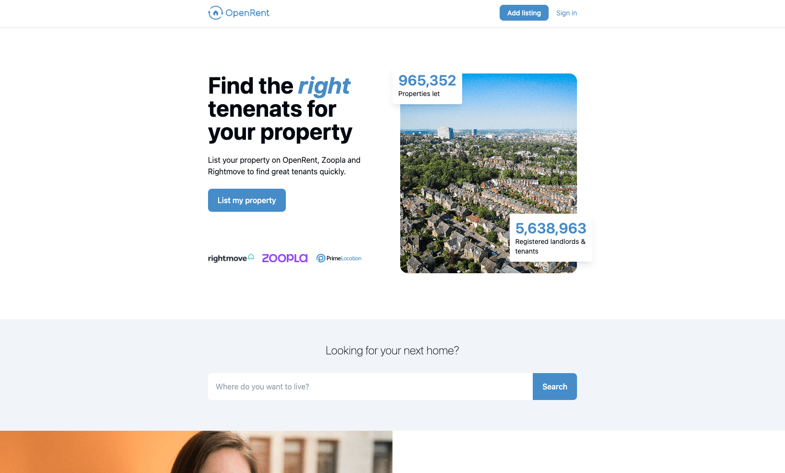
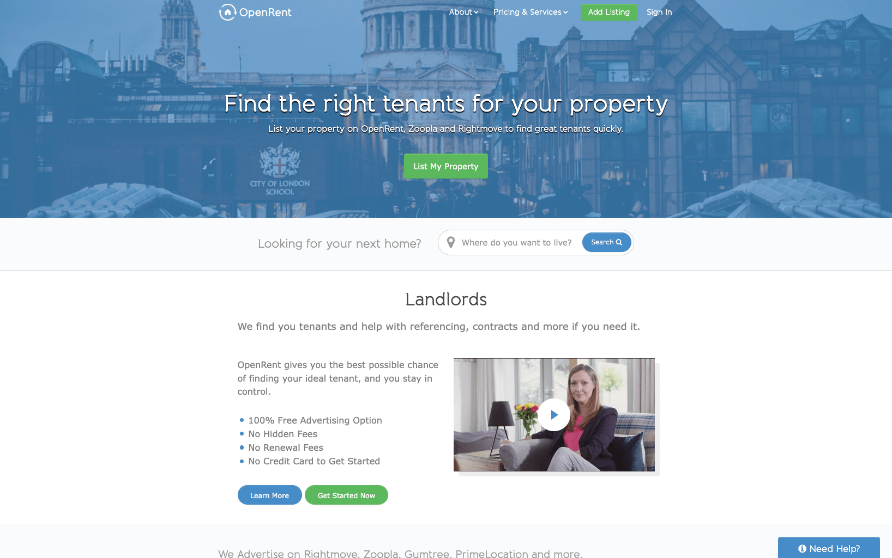

# [OpenRent](https://openrent.co.uk) Homepage Redesign 🏠



> Following on from that, given publicly accessible work is often limited and doesn't necessarily show off your current ability, we like to get candidates to perform a small front-end based project. If you could take a page on our site (any you like), and put together an alternative design/UI/UX. I wouldn't spend _too_ much time on this, but bonus points for it working with a live demo! The idea here is to see, without any real brief, what you'd do to our UI / UX. It's also hopefully a chance to show off technical, design and product development ability!

## Current Site 📆



## Getting Started 🏃‍♂️

> Remember to `npm install`!

If you want to run it locally,

```
npm run dev
```

## Stack 🍔

- React + Typescript
- Vite
- Tailwindcss

## Future work 🔮

If I had more time or was really building this as part of a real project there are several things I would try to do:

- Spend time on the design/planning. As I didn't want to take too long I went straight into development
- Add some animations
- Compress images further - I passed them through a compress but they are still v big so makes the page load slow - I probably would have taken a look into lazy/progressive loading techniques
- Accessibility improvements - the current brand colour used currently produces a warning
- Write some tests
- Mobile navigation
- Reduce amount of hardcoded data (hardocded in this case as this is just an example of a one off page design)
- Add social media links to footer
- Improve the `PropertyGrid` component on mobile (currently too long)
- Refactor code - e.g. `Landlords.tsx` and `Tenants.tsx` are very similar
